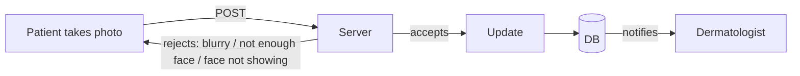
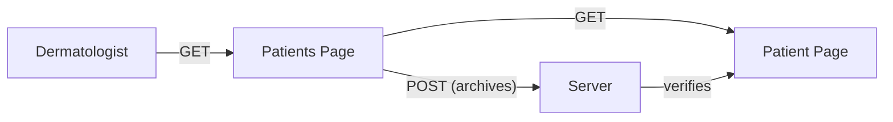

# Sentinel Derm — Technical Documentation

> **Purpose of this document:** Single source of truth / context file for humans and AI agents (Claude, Codex, etc.) working on this project. It captures the project overview, system architecture, authentication model, API endpoints, user flow, file structure, the ML inference service, and notifications. Read this in full alongside `AGENTS.md` and `ProjectStructure.md` before touching code.

## Table of Contents

1. [Project Overview](#1-project-overview)
2. [System Architecture](#2-system-architecture)
3. [Authentication & Authorization (Supabase)](#3-authentication--authorization-supabase)
4. [API Endpoints](#4-api-endpoints)
5. [User Flow](#5-user-flow-patient-anonymous-kiosk-session--dermatologist-authenticated)
6. [Pages / File Structure](#6-pages--file-structure)
7. [ML Inference Service (Railway)](#7-ml-inference-service-railway)
8. [Notifications](#8-notifications)

---

## 1. Project Overview

**Problem:** Patients may have skin conditions that need faster triage, but doctors have limited time and need organized information before seeing them.

**Users:**
- **Patients** checking in at a dermatology clinic.
- **Doctors (dermatologists)** reviewing patient cases.

**What the patient does:** Checks in, uploads or takes skin images, answers symptom questions, and submits their case.

**What the AI does:** Analyzes skin images, detects possible conditions, summarizes visible symptoms, and assigns an urgency level.

**What the doctor sees:** A queue of patients ranked by urgency, AI-generated notes, image previews, and possible condition categories.

**Main features:** Image upload, YOLO classification, urgency scoring, patient queue, AI summary, doctor dashboard, notes.

**Stack:** Patient kiosk — React Native with Expo Go (shared device, no accounts), `apps/kiosk`. Dermatologist dashboard — Next.js (authenticated), `apps/dashboard`. Backend — Supabase (Auth, Postgres + Row Level Security, Storage), `supabase/`. ML inference — FastAPI + Ultralytics YOLO26m (classification, not object detection), hosted on Railway (CPU-only, no GPU), `services/ml-inference`.

> [!IMPORTANT]
> **What the AI must NOT do:** The AI is **not diagnosing patients**. It only helps **prioritize and summarize** cases for doctor review.

**Demo goal:** Show how AI can help dermatology clinics identify high-risk cases faster and reduce doctor workload.

**Product feel:** Simple, clinical, fast, trustworthy — easy for patients, efficient for doctors.

---

## 2. System Architecture

### Flow A — Patient sends a photo

**Steps (as drawn):**
1. **Patient takes photo.**
2. Patient **POST**s the photo to the **Server**.
3. The Server validates the photo:
   - **Accepts** → **Update** → write to **DB**.
   - **Rejects** → returns a reason and the flow **restarts** (loops back to "Patient takes photo"). Rejection reasons:
     - Blurry
     - Not enough face
     - Face not showing
4. Once accepted and the DB is updated, the **DB notifies the Dermatologist**.



### Flow B — After the Dermatologist is notified

**Steps (as drawn):**
1. **Dermatologist** **GET**s the **Patients Page**.
2. The Patients Page **GET**s the **Patient Page** (loads that patient's data).
3. The Patients Page **POST**s (**archives** the case) to the **Server**.
4. The Server **verifies** and updates the **Patient Page**.



---

## 3. Authentication & Authorization (Supabase)

Both clients sit on Supabase (Auth, Postgres, Storage). Access control is enforced by Postgres Row Level Security (RLS), not by checks inside individual route handlers — this matters because the API table in Section 4 has separate "Patient" and "Dermatologist" rows on overlapping routes, and RLS is what actually makes that separation hold at the data layer.

### Patient / kiosk (anonymous, per-session)
- The kiosk has no patient accounts. When a patient starts a new check-in, the app calls Supabase Auth's anonymous sign-in (`signInAnonymously()`), which issues a JWT scoped to a fresh `sub` (UUID), `role: authenticated`, `is_anonymous: true`.
- That UUID is stored as `patient_owner_id` on the row created by the check-in `POST`. Every later call in that session (image upload, name/phone `PATCH`, queue-position `GET`) reuses the same anonymous JWT, so RLS can scope each one to "only this row."
- On a successful selfie or an early exit, the app signs out and discards the session; the kiosk resets to the Initial Page and the next patient gets an entirely new anonymous identity. This is what prevents one patient from reading or guessing another patient's record.

### Dermatologist (Next.js, real accounts)
- Dermatologists authenticate with Supabase Auth (email/password or magic link) via `@supabase/ssr`, so sessions are readable server-side in Next.js.
- A `profiles` table (`id uuid references auth.users(id)`, `role text`) marks an account as `dermatologist`. Patients never get a `profiles` row.

### Enforcement (RLS, not app code)
- `patients` table: a patient may `select`/`update` only the row where `auth.uid() = patient_owner_id`; a dermatologist (per `profiles.role`) may `select` any row and is the only role permitted to archive a ticket or insert notes.
- `selfies` storage bucket: patients may insert only under their own `patient_owner_id` path prefix; dermatologists may read any path.
- Because this lives in the database, a route added later without an explicit permission check is still blocked from returning or mutating data the caller isn't allowed to touch.

### Patient entity fields
- `name` — patient-entered name.
- `phoneNumber` — patient-entered phone number.
- `reasonForVisit` — enum-style patient-selected reason (`acne`, `eczema`, `keratosisPilaris`, `psoriasis`, `warts`, `benign`, `malignant`, `other`).
- `additionalNotes` / `additional_notes TEXT` — optional free-text context from the kiosk's "Anything else you would like to add?" field. API payloads use camelCase (`additionalNotes`); the database column should use snake_case (`additional_notes`) when the schema migration is updated.
- `patient_owner_id` — UUID from the patient's anonymous Supabase session; RLS scopes patient access to this owner.

---

## 4. API Endpoints

Columns: **Context**, **Req Type**, **Req Body**, **Route**, **Res Status**, **Res Body**.

> **Auth:** Every Patient-context route below requires the caller's Supabase anonymous session to match `patient_owner_id` on that row. Every Dermatologist-context route requires a Supabase session where `profiles.role = 'dermatologist'`. Both are enforced by RLS (Section 3) — the table does not repeat this on every row.

| Context | Req Type | Req Body | Route | Res Status | Res Body |
|---|---|---|---|---|---|
| **Patient** | `POST` |  | `patients/{patientID}` | `200` | `{"data": {"id": "<uuid>"}}` |
| **Patient** | `PATCH` | `{"name": "<txt>", "phoneNumber": "<txt>", "reasonForVisit": "<acne/eczema/keratosisPilaris/psoriasis/warts/benign/malignant/other>", "additionalNotes": "<txt-or-null>"}` | `patients/{patientID}/data` | `200` | `{"data": {"name": "<txt>", "phoneNumber": "<txt>", "reasonForVisit": "<txt>", "additionalNotes": "<txt-or-null>"}}` |
|  |  |  |  | `400` | `{ error: "Try again" }` |
|  |  |  |  | `500` | `{ error: "DB down" }` |
| **Patient** | `POST` | `webp/file` | `patients/{patientID}/image` | `200` | `{"data": {"url": "<url>"}}` |
|  |  |  |  | `400` | `{ error: "blurry / no face / face not showing / image over 100MB" }` |
|  |  |  |  | `500` | `{ error: "AI down" }` |
| **Patient** | `PATCH` | `{"imageUrl": "<url>"}` | `patients/{patientID}/data` | `200` | `{"data": {"imageUrl": "<url>"}}` |
|  |  |  |  | `400` | `{ error: "invalid or unreachable image url" }` |
|  |  |  |  | `500` | `{ error: "AI down" }` |
| **Patient** | `GET` |  | `patients/{patientID}/queue` | `200` | `{ "data": {"queuePosition": <int>} }` |
|  |  |  |  | `400` | `{ error: "not found" }` |
|  |  |  |  | `500` | `{ error: "DB down" }` |
| **Dermatologist** | `GET` |  | `patients` | `200` | `{"data": {"patients": [...], "nextCursor": "<opaque-or-null>"}}` |
|  |  |  |  | `400` | `{ error: "invalid query parameter" }` |
|  |  |  |  | `500` | `{ error: "DB down" }` |
| **Dermatologist** | `GET` |  | `patients/{patientID}` | `200` | `{ "data": {"image": "<url>", "conditions": [{"label": "<acne/eczema/keratosisPilaris/psoriasis/warts/benign/malignant>", "confidence": <float>}], "name": "<txt>"} }` |
|  |  |  |  | `400` | `{ error: "not found" }` |
|  |  |  |  | `500` | `{ error: "DB down" }` |
| **Dermatologist** | `POST` |  | `patients/{patientID}/archive` | `200` | `{"data": {"status": "archived"}}` |
|  |  |  |  | `400` | `{ error: "already archived / not found" }` |
|  |  |  |  | `500` | `{ error: "DB down" }` |
| **Dermatologist** | `POST` | `{"notes": "<txt>"}` | `patients/{patientID}/notes` | `200` | `{"data": {"noteId": "<uuid>"}}` |
|  |  |  |  | `400` | `{ error: "notes over 10MB" }` |
|  |  |  |  | `500` | `{ error: "DB down" }` |

**Status code conventions used:**
- `200` — success
- `400` — client/validation error (bad photo, not found, already archived)
- `500` — server-side failure (DB down, AI down)

> **Classification shape (`conditions` field) — provisional:** built around YOLO26m (Ultralytics), trained as an image classifier (not an object detector) on seven classes: `acne`, `eczema`, `keratosisPilaris`, `psoriasis`, `warts`, `benign`, `malignant`. Each result is `{"label": "<one of the seven>", "confidence": <float 0-1>}` — no `box` field, since a classifier scores the whole image rather than localizing a region. This is a proposal, not a confirmed contract — the actual shape depends on how the Railway-hosted inference service (Section 7) ends up serializing the model's output, and the model itself is still being trained and may change.

> **Query parameters for `GET patients`** — the dermatologist list view backing `apps/dashboard`'s patients page (Section 6):
> - `status` — `open` (default; non-archived) / `archived` / `all`.
> - `condition` — comma-separated labels to filter by, from the seven trained classes (`acne`, `eczema`, `keratosisPilaris`, `psoriasis`, `warts`, `benign`, `malignant`); omitted = no condition filter. Decided: matches *any* detection of that label, regardless of confidence — no threshold applied.
> - `sort` — `recent` (default, by check-in time) / `urgency`.
> - `order` — `desc` (default) / `asc`.
> - `cursor` — opaque cursor from a previous response's `nextCursor`; omitted on the first request.
> - `limit` — page size, default `20`, max `50`.
>
> This is cursor-based pagination (Section 6) — `cursor` replaces a page-number param entirely; there's no `page`/`offset` here. `sort=recent` is the default (matching Section 6's "most recent" framing of this list), with `sort=urgency` available for the urgency-ranked view called out in Section 1.

> **Resolved design decision:** the original handwritten design notes had one ambiguous "outside/inside `patients/{patientID}`" `POST` distinguished by a `{"outside": true/false}` body flag and a non-standard `300` status. There's only one dermatologist action here, not two: a dermatologist opens a patient's case, reviews it, and archives it when done. That's now the single `POST patients/{patientID}/archive` route above, with permission checks handled by RLS (Section 3) instead of an app-level "permission" error string. The original "outside/inside" framing was just describing where the click originates (notification vs. patients list), not two distinct server actions — don't reintroduce a separate `/claim`-style route based on that wording.

---

## 5. User Flow (Patient: anonymous kiosk session · Dermatologist: authenticated)

### Patient

1. Patient **lands on the Initial Page** (contains a **"reason for visit" dropdown box** — options: `acne`, `eczema`, `keratosisPilaris`, `psoriasis`, `warts`, `benign`, `malignant`, `other`). Worth softening the patient-facing wording for the `benign`/`malignant` options (e.g. "a spot or mole I'm concerned about") even though the stored value stays `malignant` — the raw class name reads clinically for a patient self-report.
2. Patient **inputs name + phone number + reason for visit + optional additional notes** and **submits** (`PATCH patients/{patientID}/data`, Section 4) → Initial Page.
3. Patient **lands on the Capture Page**.
4. Patient **takes an acceptable selfie and submits** → Capture Page.
5. Capture Page shows: **"Take a seat and wait for your name to be called out"** → Patient.
6. *(Side path)* **Server** sends a **queue notification via SMS** (Twilio, see Section 8) → Patient.

### Dermatologist

1. **Server notifies on the website** (Supabase Realtime, see Section 8) → Dermatologist.
2. Dermatologist **clicks the notification** *or* **clicks the patient in the patients list** → Patient Page.
3. Dermatologist **analyzes the data** → Patient Page.
4. Dermatologist **closes the ticket** (`POST patients/{patientID}/archive`) → Patient Page.

### Extra / Stretch

Provide an **API that external medical services can connect to**. We supply the patient profile (**name + phone number + face**) to connect to the client web app for an **initial record**.

---

## 6. Pages / File Structure

> Filenames below are logical page names from the original design. See `ProjectStructure.md` for how they map onto actual Expo Router / Next.js App Router paths in this repo.

### Patient Kiosk — React Native (Expo Go) — `apps/kiosk`

| Logical page | Purpose |
|---|---|
| `index` | Entry point — where the patient starts check-in and inputs their data (name, phone number, reason for visit, optional additional notes) — everything except the image. |
| `capture` | Where the patient reviews photo guidance, takes their selfie, and sees the final wait-for-doctor state. |

> Both pages run within a single anonymous Supabase session (Section 3) for that patient. Once the selfie succeeds — or the patient exits — the session is discarded and the kiosk returns to `index` for the next patient.

Implemented foundation files:

| Path | Purpose |
|---|---|
| `apps/kiosk/app/_layout.tsx` | Expo Router stack for the two kiosk routes. |
| `apps/kiosk/app/index.tsx` | Thin route file that renders the check-in wizard. |
| `apps/kiosk/app/capture.tsx` | Thin route file that renders the photo capture flow. |
| `apps/kiosk/components/kiosk/CheckInWizard.tsx` | Welcome, intro, identity, reason/notes wizard states. |
| `apps/kiosk/components/kiosk/CaptureFlow.tsx` | Photo guidance, camera permission, selfie capture, review, submit, and final wait state. |
| `apps/kiosk/components/kiosk/KioskShell.tsx` | Shared patient-facing screen shell. |
| `apps/kiosk/components/kiosk/PrimaryButton.tsx` | Shared button primitive. |
| `apps/kiosk/lib/supabase.ts` | Lazy Supabase client configured from Expo public env vars, with no persisted kiosk session. |
| `apps/kiosk/lib/patient-session.ts` | Thin client calls for anonymous sign-in, patient row insert/update, selfie upload, Edge Function invocation, and sign-out. |
| `apps/kiosk/types/patient.ts` | Kiosk-local reason/session/form types. |
| `apps/kiosk/theme/colors.ts` | Native semantic color palette. |

Required Expo public env vars for the kiosk app:

| Variable | Purpose |
|---|---|
| `EXPO_PUBLIC_SUPABASE_URL` | Supabase project URL used by the kiosk client. |
| `EXPO_PUBLIC_SUPABASE_ANON_KEY` | Supabase anon key used for anonymous Auth and RLS-scoped database/storage calls. |
| `EXPO_PUBLIC_SUPABASE_IMAGE_FUNCTION` | Optional Supabase Edge Function name for image processing; defaults in code to `process-patient-image`. |

#### Current Figma kiosk storyboard mapping

The Figma `Kiosk` section currently contains seven iPad storyboard frames. These are interaction states inside the two logical Expo Router pages above, not seven separate routes:

| Figma frame | Purpose | Expo route |
|---|---|---|
| `iPad Pro 11" - 1` | Welcome screen with Check In button. | `index` |
| `iPad Pro 11" - 2` | Transitional intro: "Lets check you in". | `index` |
| `iPad Pro 11" - 3` | Name and phone number inputs. | `index` |
| `iPad Pro 11" - 4` | Reason for visit dropdown plus optional additional notes. | `index` |
| `iPad Pro 11" - 5` | Photo comfort/privacy guidance. | `capture` |
| `iPad Pro 11" - 6` | Camera/photo capture state. | `capture` |
| `iPad Pro 11" - 7` | Done state telling the patient the doctor will see them shortly. | `capture` |

This keeps routing aligned with the product architecture while still letting the kiosk feel like a multi-step wizard.

### Dermatologist Dashboard — Next.js — `apps/dashboard`

| Logical page | Purpose |
|---|---|
| `signup` | Entry point for a dermatologist who isn't verified yet. |
| `login` | Login for an already-verified dermatologist. |
| `dashboard` | Sidebar with tabs and the most recent patient profiles. |
| `dashboard/patients` | Scrollable list of the most recent, non-archived patients, with filters (include archived, skin condition/disease type) and sorting. |
| `dashboard/patients/{patientID}` | A single patient's profile — image, concerns, data, and AI summary. |

> `dashboard/patients` is backed by `GET patients` (Section 4), using cursor-based (keyset) pagination rather than offset: this list is a live, frequently-mutating queue (patients checking in, cases being archived) rendered as infinite scroll, and offset pagination (`LIMIT`/`OFFSET`) silently skips or duplicates rows when the underlying order shifts mid-scroll — the wrong tradeoff for a clinical queue. Cursor pagination instead asks for "the next N rows after the last one I saw," keyed on a composite, indexed sort — e.g. `(sort_column, created_at, id)`, with `id` as a tiebreaker so equal sort values don't produce gaps or duplicates. There's no "jump to page N," only next/previous relative to a cursor, which matches the scroll UI here. Full query-parameter list (`status`, `condition`, `sort`, `order`, `cursor`, `limit`) is in Section 4.

---

## 7. ML Inference Service (Railway) — `services/ml-inference`

A third service, separate from both client apps and from Supabase itself:

- **What it is:** A FastAPI app wrapping the YOLO26m (Ultralytics) model, deployed on Railway as its own always-on service — not a serverless function. The model loads once into memory at process startup and stays there; there's no per-request cold start, and no GPU (Railway doesn't offer GPU instances, so this is CPU-only inference). YOLO26m is run in classification mode, not detection — it scores the whole image against the seven trained classes rather than localizing regions, so there's no `box` output to serialize.
- **Deployment:** built from a `Dockerfile` in `services/ml-inference` (Railway auto-detects it; `railway.json` pins the builder and sets the `/health` healthcheck). `torch`/`torchvision` install from the PyTorch CPU wheel index (`https://download.pytorch.org/whl/cpu`) to honor the CPU-only constraint and avoid pulling the multi-GB CUDA build. The container binds uvicorn to Railway's injected `$PORT`. In Railway, set the service's **root directory** to `services/ml-inference` so the monorepo builds from the right context. The image targets Python 3.12 for broad Linux wheel coverage even though local dev uses 3.14.
- **Who calls it:** Not the kiosk directly, and not the dermatologist dashboard directly. `PATCH patients/{patientID}/data` with `{"imageUrl": "<url>"}` (Section 4) is implemented as a Supabase Edge Function rather than a plain PostgREST passthrough: it updates the row, calls this Railway service synchronously with the image, waits for the classification result, writes it back to the row, and only then responds to the kiosk. This is why that route's `500` failure mode is specifically `"AI down"` (Section 4) — that error means *this* service was unreachable or erroring, not Supabase itself.
- **Contract:** `POST <railway-url>/classify` with `{"imageUrl": "<url>"}` → `{"detections": [{"label": "<acne/eczema/keratosisPilaris/psoriasis/warts/benign/malignant>", "confidence": <float>}], "urgencyLevel": "<routine/urgent/emergent>", "summary": "<txt>"}` — the full combined shape (see the bottom of this section). The Railway service computes all three: `detections` from the model, `urgencyLevel` from the mapping below, and the templated `summary`. The Edge Function stores the response on the patient row as-is. The `detections` field keeps its name for continuity with Section 4 even though the model is a classifier, not a detector; its per-item `{label, confidence}` shape matches the `conditions` field in Section 4.
- **Error responses (`/classify`):** `400 {"detail": "invalid or unreachable image url"}` when the image URL can't be fetched or decoded (network error, non-2xx, or undecodable image); `500 {"detail": "AI down"}` when the model/inference step itself fails. These map to the kiosk-facing `PATCH patients/{patientID}/data` error rows in Section 4 — the Edge Function translates the FastAPI `detail` shape into that route's `{error}` shape.
- **Urgency level** (computed in the Railway service from the detections and returned in the `/classify` response): the teledermatology triage literature treats "urgent suspected cancer" as its *most* time-critical tier — more urgent than a generic dermatologic referral — and `malignant` is exactly that signal. 3-tier enum:
  - `routine` (default) — `acne` alone; `benign` alone (it's explicitly benign by definition); `keratosisPilaris` alone (cosmetic, not actively symptomatic).
  - `urgent` — `eczema` alone; `psoriasis` alone; `warts` alone (chronic/inflammatory conditions that can need active treatment, but aren't a possible-malignancy signal).
  - `emergent` — `malignant` detected, at **any** confidence (a possible-malignancy flag is treated as top priority — confidence-gating this felt wrong given the cost of a missed flag).
  - This stays inside the AI boundary (Section 1) — it flags "needs faster human eyes," it doesn't diagnose. The `benign`/`malignant` classes edge this system closer to cancer-screening territory than a purely cosmetic/chronic class list would. That raises the stakes on a false negative here — keep the dashboard's language carefully non-diagnostic for this specific class ("flagged for review," not "possible skin cancer").
- **AI summary:** generated eagerly, in this same Railway `/classify` step, right when the photo is processed, and returned alongside `detections` and `urgencyLevel` for the Edge Function to store on the row. By the time the dermatologist opens the patient page, it's already there — `GET patients/{patientID}` is a plain read, no generation latency, no cache to invalidate, no risk of a duplicate-generation race if the page is opened twice before a cache populates.
- **Summary method:** templated, no LLM. Built directly from the structured `detections` (e.g. `"Detected: eczema (91.0% confidence)."`, with confidence shown to one decimal place) rather than a real LLM call. No extra cost, no added latency, no third external dependency beyond Supabase and Railway — at the cost of reading less like natural prose. The "AI-generated" wording in Section 1 refers to this template being driven by the AI's detections, not to an LLM writing the sentence.
- **Combined shape — what gets written to the patient row after processing:**
  ```json
  {
    "detections": [{"label": "eczema", "confidence": 0.91}],
    "urgencyLevel": "urgent",
    "summary": "Detected: eczema (91.0% confidence)."
  }
  ```

---

## 8. Notifications

Two different mechanisms, one per audience.

### Patient — SMS via Twilio
Triggered from the same Edge Function pipeline as Section 7, right after a photo is accepted and the queue position is known. Sent with a direct REST call (no SDK, so it works the same in Supabase's Deno runtime as anywhere else):
```ts
await fetch(`https://api.twilio.com/2010-04-01/Accounts/${SID}/Messages.json`, {
  method: "POST",
  headers: {
    Authorization: `Basic ${btoa(`${SID}:${AUTH_TOKEN}`)}`,
    "Content-Type": "application/x-www-form-urlencoded",
  },
  body: new URLSearchParams({ To: patientPhone, From: twilioNumber, Body: `You're #${queuePosition} in line.` }),
});
```
Demo note: Twilio trial accounts can only text phone numbers manually verified in the Twilio console first — verify demo phones ahead of time, or sends will silently fail during the live demo.

### Dermatologist — Supabase Realtime
The dashboard subscribes to database changes directly over WebSockets instead of polling, client-side in the `dashboard` page (Section 6):
```ts
supabase
  .channel("patients-queue")
  .on("postgres_changes", { event: "INSERT", schema: "public", table: "patients" }, (payload) => {
    // new check-in arrived — show a toast/badge
  })
  .subscribe();
```
Requires enabling Realtime on the `patients` table first (`alter publication supabase_realtime add table patients;`, or the toggle in the Supabase dashboard UI). Realtime respects RLS (Section 3) — a dermatologist's subscription only ever receives rows their policies already allow them to see, so no extra filtering is needed beyond what's already enforced at the data layer.

---

## Quick Reference for Agents

- **Stack:** React Native kiosk (`apps/kiosk`, patient, anonymous Supabase session) + Next.js dashboard (`apps/dashboard`, dermatologist, real Supabase account) + Supabase (`supabase/`; Auth, Postgres + RLS, Storage) + a separate FastAPI/YOLO26m classification service (`services/ml-inference`) on Railway, CPU-only (Section 7). See Section 3 for auth, Section 7 for the inference service.
- **Auth model:** No login for patients — each kiosk session is a fresh anonymous Supabase Auth session scoped to one patient row, discarded on success/exit. Dermatologists have real accounts gated by `profiles.role = 'dermatologist'`. Access is enforced by Postgres RLS, not by checks inside route handlers — don't add app-level permission logic that duplicates what RLS already guarantees.
- **Two surfaces:** (1) Patient flow → Initial Page → Capture Page → queue/SMS. (2) Dermatologist flow → website notification → Patient Page → analyze → close ticket.
- **AI boundary:** classify + summarize + score urgency only. **Never diagnose.**
- **Core entities:** Patient (name, phone, `reasonForVisit`, optional `additionalNotes` / `additional_notes TEXT`, metadata, image, `patient_owner_id`), Profile (dermatologist accounts, `role`), Detection/Conditions (YOLO26m classification, no bounding box; classes: acne, eczema, keratosisPilaris, psoriasis, warts, benign, malignant — shape still provisional, see Section 4), `urgencyLevel` (`routine`/`urgent`/`emergent`, decided, Section 7), `summary` (AI summary, eagerly generated, templated — not LLM-generated, Section 7), Queue, Ticket (open/archived), Note.
